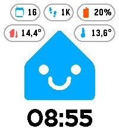
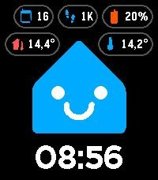

# Casita Watchface — Documentation

A Pebble watchface that shows the [Home Assistant](https://www.home-assistant.io/)
"Casita" mascot with a mood that changes across the day, above a large clock.
When the watch loses its Bluetooth link to the phone, Casita switches to a
"disconnected" expression.

It is written in **TypeScript**, rendered with the new Pebble **Alloy / Moddable
JS SDK** (`commodetto/Poco`), and orchestrated with **Bun** via **Mise**. Artwork
ships as **Pebble Draw Command** (`.pdc`) vector images generated from SVG by a
self-contained Python converter.

## Screenshots

| Light theme | Dark theme |
| :---: | :---: |
|  |  |

## Expressions

| Local time    | Expression   | Resource                | Body color            |
| ------------- | ------------ | ----------------------- | --------------------- |
| 06:00 – 11:59 | Normal       | `CASITA_NORMAL`         | blue `#18bcf2`        |
| 12:00 – 14:59 | Happy        | `CASITA_HAPPY`          | blue `#18bcf2`        |
| 15:00 – 20:59 | Grinning     | `CASITA_GRINNING`       | blue `#18bcf2`        |
| 21:00 – 05:59 | Sleeping     | `CASITA_SLEEPING`       | gray `#999999`        |
| temp ≥ 30 °C  | Sweating     | `CASITA_SWEATING`       | blue `#18bcf2`        |
| any (BT down) | Disconnected | `CASITA_DISCONNECTED`   | orange `#f7931e`      |

"Disconnected" means the watch has no Bluetooth connection to the phone app
(`watch.connected.app`); it overrides every other expression. When connected, a
last weather reading of **30 °C or hotter** (from the Temperature badge's
Open-Meteo fetch) shows the **Sweating** face regardless of the time of day;
otherwise the time-of-day expression applies. The facial features stay off-white
(`#f2f4f9`) in every expression; only the body color changes.

The clock follows the watch's 12/24-hour preference: 24h uses a leading-zero
hour (`07:05`), 12h drops it (`7:05`, with `12` for midnight/noon).

## Settings

The watchface has a settings page, opened from the **Casita** entry in the
Pebble/Rebble phone app ("Settings"). Options:

- **Appearance — Light / Dark / Auto:** sets the background to white (with black
  clock) or black (with white clock). **Auto** follows the sun — light between
  local sunrise and sunset and dark otherwise, using sunrise/sunset times fetched
  for your location from Open-Meteo (the same source as the temperature badge).
  If the phone can't supply sun times yet, Auto falls back to Dark. Default is
  **Dark**.
- **Badges — Date / Temperature / Steps / Battery / Home temperature:**
  individually show or hide the top badges (all default to **on**), and reorder
  them with the ▲ ▼ buttons to set their priority. The first badge sits in the
  top-right corner and the others fill leftwards from it; the top row takes
  three, and any further badges drop to a second row pinned to the two corners,
  leaving the middle free for Casita's roof peak so Casita keeps its full size.
  On the round Pebble the rows hold one, two and two badges: one centred at
  the top, two centred below it, the rest at the circle's edge beside the roof. The **Home temperature** badge only appears once
  Home Assistant is connected and a sensor is chosen (see below).

How it works:

- The config UI is a self-contained `data:` HTML page; no external hosting
  needed. Its markup lives in `src/pkjs/config.eta` ([Eta](https://eta.js.org/)
  template) and is rendered to a plain string at build time — Eta runs only at
  build, nothing ships to the phone. The current preferences are injected at
  runtime as a JSON blob (replacing a `__CONFIG__` token) and applied to the
  form by a small inline script. Tapping **Save** hands the choices to the app by
  navigating to `pebblejs://close#<json>`. That navigation is the platform's
  *only* channel back to the watch (there is no live/continuous link), so closing
  the page is what actually applies the settings — hence Save closes the page.
- On save, the phone persists the choices (`localStorage`) and sends them to the
  watch over AppMessage: `THEME` (0 = light, 1 = dark), `SHOW_WEATHER`,
  `SHOW_STEPS`, `SHOW_DATE` and `SHOW_BATTERY` (0 = off, 1 = on),
  and `BADGE_ORDER` (the badge priority order as a compact code string,
  e.g. `dwsb` = date, weather, steps, battery). The one message in the other
  direction is `REFRESH`, which the watch sends to ask for fresh data (see
  [Refresh cadence](#refresh-cadence)).
- The watch persists every preference in its own `localStorage`, so it renders
  with the right colors and badges immediately on launch, before the phone
  reconnects.

## Home Assistant connection

The settings page can connect to your Home Assistant instance to add a second,
home temperature badge. Home Assistant has its own **dedicated page** inside
settings, reached from a distinct **Connect / Manage Home Assistant** button
(with a status dot) — separate from the main **Save** button.

Setup, in the phone **Settings** page:

- Tap **Connect Home Assistant** to open the Home Assistant page, enter your
  Home Assistant URL, and tap **Log in to Home Assistant**. Home Assistant's own
  login screen opens — you never create or paste a token by hand.
- **Use a remote URL** (e.g. your [Nabu Casa](https://www.nabucasa.com/) address
  or a reverse-proxied `https://` URL) so the watch works everywhere, not just on
  your home Wi‑Fi.
- **Recommended:** create a dedicated Home Assistant user for the watch with
  limited permissions instead of using your admin account.

After you log in, Home Assistant's OAuth screen forces **Settings to close**.
**Reopen Settings** from the Pebble app — it drops you straight back into the
Home Assistant page, now **Connected**, showing the number of available
temperature sensors and a searchable **entity picker** to choose the home
temperature sensor (each sensor's friendly name and area, like the Home
Assistant frontend picker), plus a **Disconnect** button. Pick a sensor, go
back, and Save. When a sensor is selected the page collapses to show just that
sensor (name, area and its **current value**) with a **Remove sensor** button,
and a **Home temperature** badge becomes available in the main badge list —
reorderable and toggleable like the others.

**The Home Assistant page has no Save button of its own** — connect/disconnect
and the chosen sensor are only applied when you tap the main **Settings → Save**,
exactly like every other setting. Tapping **Disconnect** immediately flips the
page to the disconnected (connect) view — with a "will disconnect when you save"
note and a **Keep connected** undo — but nothing is actually cleared until you
save Settings. A fresh login is likewise a *draft*: the connected page shows a
"Not saved yet" hint. Because the OAuth login has to close the settings to run,
that draft **persists across reopens** (the login isn't thrown away just because
the page reopened) until you either **Save** it or
**Disconnect** and Save.

How it works (all phone-side):

- Home Assistant uses IndieAuth-style OAuth2: the `client_id` must be a public
  `https` page whose host matches the `redirect_uri`. A tiny static page hosted
  on GitHub Pages (`docs/index.html` + `docs/callback.html`, served at
  `https://wendevlin.github.io/pebble-casita-watchface/`) fills that role — it
  just receives `?code=&state=` from Home Assistant and bounces it back to the
  app via `pebblejs://close#…`.
- The config webview navigates to `<ha-url>/auth/authorize?…`; after login,
  `callback.html` returns the code to pkjs. pkjs (`src/pkjs/index.ts`) exchanges
  it at `<ha-url>/auth/token` for access/refresh tokens (persisted in
  `localStorage`), then fetches the temperature sensors via
  `POST <ha-url>/api/template` (a Jinja template that resolves each sensor's
  friendly name and area via `area_name()`), falling back to
  `GET <ha-url>/api/states` (name only) if templating is unavailable. The sensor
  list is cached in `localStorage` so the settings page can render the picker
  immediately, and refreshed in the background on open.
- The config page is a small two-view SPA (main settings + the Home Assistant
  page); switching views is client-side, so opening the Home Assistant page does
  **not** close settings. Only **Save** and the **login** redirect navigate to
  `pebblejs://close#…`. Connect/disconnect are staged as an in-page draft and
  sent to pkjs as a `haConnected` boolean in the Save payload; pkjs commits or
  clears the connection accordingly. A completed login is kept as a connected
  draft (tokens persisted) until it is saved or explicitly disconnected.
- The OAuth URL building, state encoding, token bodies, the sensor template,
  sensor-list parsing/search and the state→°C conversion are pure functions in
  `src/pkjs/ha.ts` (unit-tested in `tests/ha.test.ts`). The config
  webview re-implements the tiny base64url/state and search bits inline because
  it runs in its own sandbox and cannot import that module.
- **Home temperature reading:** once connected with a sensor selected, pkjs
  reads `<ha-url>/api/states/<id>` on every refresh (see
  [Refresh cadence](#refresh-cadence)) and sends the value to the watch as
  `HA_TEMP` (tenths of a degree Celsius, converted from °F when the sensor
  reports Fahrenheit). A token about to expire is refreshed first; a `401` on the
  request triggers one refresh-and-retry. An earlier live WebSocket feed was
  dropped: every pushed reading is an AppMessage that wakes the watch, and a
  room temperature does not need that.

## No white flash on focus return

The face paints straight into the framebuffer, but the window created in
`src/c/mdbl.c` has a root layer, and with the default white background the
firmware repainted the window white whenever the face came back into view after
a notification or the menu — a visible flash until the next JS frame. The window
background is therefore `GColorClear`: the root layer paints nothing and the last
JS frame simply stays on screen. (A zoom-in intro animation was tried on top of
this and removed again: it read as distracting on the wrist.)

## Refresh cadence

Weather, sun times and the Home Assistant reading all refresh together, every
**30 minutes**, and the **watch** drives it. PebbleKit JS runs inside the Pebble
mobile app, and its timers stall whenever the phone freezes that app in the
background — so a phone-side `setInterval` alone leaves a stale value on the
watch for hours (the symptom: a morning temperature that never changes). An
inbound AppMessage does wake the JS, so:

- `main.ts` sends `REFRESH` from its minute tick whenever the minute of the
  hour is a multiple of 30, and once more whenever the phone link comes back
  (after a night in airplane mode, say). The send is skipped while disconnected
  and any outbox error is ignored — the next interval retries.
- `index.ts` handles that message by calling `refreshAll()`: the Open-Meteo
  fetch (weather + sunrise/sunset) and the HA sensor GET. The same function runs
  once on launch and on Save. There is deliberately no phone-side timer: it
  would stall in the background anyway, and while the app is awake it would only
  double the traffic against the watch's own cadence.
- **Phone → watch pushes are serialised.** The watch runtime keeps only the
  newest *unread* inbound message, so two pushes sent back to back can silently
  drop the first (observed in the emulator: weather lost behind the sun times).
  All pushes therefore go through a small queue in `index.ts` that waits for the
  previous message's ack before sending the next, and weather + sun times travel
  in one message — which also wakes the watch once instead of twice.

## Badges

Badges render along the top of the face in the priority order set on the
settings page (default: date, temperature, steps, battery, home). Every row is
filled **from right to left**: the first badge is the rightmost of the top row,
the next sits to its left, and so on, so the top-priority badge stays put no
matter how many others are enabled. The row planning is the pure, unit-tested
`layoutBadges()` in `logic.ts`:

- **Rectangular (Pebble Time 2):** the first row hugs the right edge and takes
  the first **three** badges (a wide trio may run past the left edge; accepted).
  Badges four and five go on a second row pinned to the **corners** — four in
  the bottom-right, five in the bottom-left — so the middle of that row stays
  clear. Only one row's worth of vertical space is reserved, so Casita keeps its
  full size: because it's a little house, its triangular roof leaves the top
  corners empty, the corner badges sit in that space and the roof peak rises
  between them. (The sleeping and disconnected expressions fill those corners,
  so they reserve the full stack and shrink Casita instead.)
- **Round (Pebble Round 2):** the circle is narrow at the top and wide just
  below, so the stack is **1 + 2 + 2**. The first badge sits alone, centred, in
  the narrow top row; badges two and three form a centred pair on the second row
  (badge 2 on the right); badges four and five go on a third row pinned to the
  circle's edge at that height — four on the right, five on the left — with the
  middle clear. The first two rows are reserved, so Casita sits below them; the
  third row overlays the roof corners just like the rectangular second row
  (the roof rises at 45°, so at the bottom of that row it is about 40 px wide,
  leaving room for even the widest temperature pill on each side).

Each badge is a rounded pill with an
[MDI](https://pictogrammers.com/library/mdi/) icon and a value:

| Badge       | Icon (MDI)       | Source                              | Format                                        |
| ----------- | ---------------- | ----------------------------------- | --------------------------------------------- |
| Date        | `calendar-blank` | The watch clock                     | Day of month, e.g. `14`                       |
| Temperature | `thermometer`    | Fetched by the phone (Open-Meteo)   | One decimal, no unit letter, e.g. `24,8°`     |
| Steps       | `shoe-print`     | Pebble Health on the watch          | `56` (<100), `0,4K` (100–999), `12K` (≥1000)  |
| Battery     | `battery`        | The watch battery (native FFI)      | Whole percent, e.g. `85%`; icon coloured by level |
| Home temp   | `home-thermometer` | A Home Assistant sensor (phone)   | One decimal, no unit letter, e.g. `21,3°`      |

- **Weather** is fetched by `src/pkjs/index.ts` using the phone's location and
  the keyless [Open-Meteo](https://open-meteo.com/) API on every refresh (see
  [Refresh cadence](#refresh-cadence)). The temperature is sent to the watch in
  tenths of a degree Celsius via the `WEATHER_TEMP` key. The last successful
  position is remembered, so when the phone refuses a fresh fix in the
  background the weather is still updated for the last known place.
- **Units (°C/°F)** are decided on the watch from `Health.displayMeasurementSystem`,
  which mirrors the Pebble app's *units* setting (imperial → °F, otherwise °C).
  The value is converted accordingly; the unit letter itself is not shown (the
  badge displays just the number and a degree sign, e.g. `24,8°`).
- **Steps** are read directly on the watch via `Health.metric.query({ metric: "step count" })`
  (which sums today's total) and refresh every minute. If Health is unavailable
  the badge is hidden.
- **Battery** is the watch's own charge level, read on the watch through a small
  native FFI bridge (`casita_battery_percent()`, a wrapper around
  `battery_state_service_peek()` — see [Native FFI bridge](#native-ffi-bridge));
  shown as a whole percent, hidden if FFI is unavailable. Its icon is colour-coded by level: green at ≥ 70%, orange at
  ≥ 30%, red below 30% (three pre-tinted PDC variants generated from the one
  `battery.svg`). The tints are the fully saturated palette entries
  `GColorGreen` (`#00ff00`), `GColorChromeYellow` (`#ff9800` → 255,170,0) and
  `GColorRed` (`#ff0000`): the converter truncates to 2 bits per channel, and the
  muted Material green that resulted from `#4caf50` (85,170,85) read as grey on
  the real Pebble Time 2 display even though it looks green in the emulator.
- **Date** shows the current day of month, read from the watch clock and
  refreshed every minute.
- **Home temperature** shows a Home Assistant sensor's reading, fetched by the
  phone on every refresh (see the Home Assistant section above) and sent in
  tenths of a degree Celsius via the `HA_TEMP` key. Like the weather badge it is displayed in °C/°F per the watch's
  own units setting, with the same text colour as the other badges, but its
  **icon** is a distinct **deep-orange** (baked into the PDC) so it reads apart
  from the blue Open-Meteo thermometer. The badge only appears when Home
  Assistant is connected, a sensor is chosen, and a reading has been received.

The MDI icons are converted to PDC by the `resources` script (see below); the
sources live in `mdi-svgs/` with an accent fill baked in.

**Colors** — background is `#fafafa` (light) / `#181818` (dark); badge pills are
`#ffffff` / `#222222`. Note the color Pebble renders only 2 bits per channel (64
colors, values snap to 0/85/170/255 via a top-2-bits truncation), so the pill
fills collapse into the background (fill == background on this hardware) and the
requested subtle borders (`#e0e0e0` / `#393939`) would truncate to pure
white/black and disappear. The badge is therefore defined by its border, and the
border colors are bumped to the nearest values that actually render as a
distinct gray: `#b0b0b0` (→ 170) on the light background and `#666666` (→ 85) on
the dark background.

## Native FFI bridge

The battery badge needs the watch's charge level, which lives behind a firmware
syscall. The face runs as a Moddable *mod*, whose JavaScript cannot call
firmware syscalls directly, but the C host (`src/c`) can — so a tiny FFI binding
bridges the two:

- `src/c/casita_ffi.c` defines `casita_battery_percent()` (a one-line wrapper
  around `battery_state_service_peek()`) plus an `fxBuildFFI` that registers it
  as a method.
- `src/c/mdbl.c` wires that `fxBuildFFI` into the Moddable creation record.
- On the JS side `hw.ts` does `new FFI()` — resolving the firmware-preloaded
  `ffi` module, whose constructor invokes our `fxBuildFFI` — and exposes
  `batteryPercent()` to the battery badge.

The FFI table is a set of *synchronous getters*: the firmware cannot deliver an
async C→JS event, so the value is simply read during the once-a-minute frame.

> **Note:** `new FFI()` is built once at startup (from `main.ts`, not from inside
> a frame, to keep the deep constructor off the small XS stack) and every call is
> wrapped in try/catch — if FFI is ever unavailable the badge just hides itself
> rather than crashing.

> **Battery note:** the face deliberately does no per-second work. A watchface
> that subscribes to the runtime's `secondchange` tick wakes the CPU and the JS
> VM 60 times a minute, which is the largest avoidable drain a watchface can
> have. An earlier *show seconds while the backlight is lit* feature polled
> `light_is_on()` at 1 Hz for exactly this reason and was removed: displaying
> seconds was not worth the overnight battery cost.

## Layout

```
.
├── casita-svgs/            # Source SVG artwork (design assets)
├── mdi-svgs/               # MDI badge icons (accent fill baked in)
├── resources/casita/       # Generated Casita .pdc images (`bun run resources`)
├── resources/icons/        # Generated badge .pdc icons (`bun run resources`)
├── src/
│   ├── c/
│   │   ├── mdbl.c          # Native shim that boots the Moddable machine (clear window bg)
│   │   └── casita_ffi.c    # Native FFI glue exposing the battery level to JS
│   ├── embeddedjs/
│   │   ├── main.ts         # Entry point: just the runtime event handlers
│   │   ├── constants.ts    # Storage keys, message keys, badge geometry
│   │   ├── gfx.ts          # Shared Poco context, fonts, image caches, palette
│   │   ├── logic.ts        # Pure expression/time/badge logic (unit-tested)
│   │   ├── resource-ids.ts # GENERATED Casita/Icon resource-ID enums (`bun run render-resources`)
│   │   ├── data/
│   │   │   └── settings.ts # Persisted preferences + health/weather reads
│   │   ├── draw/
│   │   │   ├── casita.ts   # Casita expression selection
│   │   │   ├── badges.ts   # Badge rows (date/weather/steps/battery/home)
│   │   │   └── face.ts     # Full-frame composition
│   │   ├── hw.ts           # FFI accessor (battery level)
│   │   ├── ffi.d.ts        # Types for the firmware-preloaded `ffi` module
│   │   └── manifest.json   # Moddable module manifest
│   └── pkjs/               # PebbleKit JS (phone side: settings + weather + HA)
│       ├── index.ts        #   entry; bundled to index.js by `bun run build:pkjs`
│       ├── ha.ts           #   pure Home Assistant OAuth helpers (unit-tested)
│       ├── config.eta       #   settings page markup (Eta template)
│       └── pebblekit.d.ts  #   typings for the injected `Pebble` global
├── docs/                   # GitHub Pages OAuth client_id + callback (HA login)
│   ├── index.html          #   OAuth client_id page
│   └── callback.html       #   returns the auth code to the app via pebblejs://close
├── tests/logic.test.ts     # `bun test` unit tests for logic.ts
├── tests/resources.test.ts # `bun test` guard: enum IDs match package.json media order
├── tests/ha.test.ts        # `bun test` unit tests for pkjs/ha.ts
├── tools/svg2pdc.py        # Self-contained SVG -> PDC converter
├── tools/build-pdc.ts      # Job table: which SVGs become which .pdc, in which tint
├── tools/render-config.ts  # Renders config.eta -> config-html.ts at build time
├── tools/render-resources.ts # Derives resource-ids.ts from package.json media order
├── types/moddable-pebble.d.ts  # Local typings for standalone typecheck
├── tsconfig.tools.json     # Typecheck config for the Bun build tools
├── package.json            # Project + Pebble manifest + scripts
├── mise.toml               # Toolchain pinning
└── tsconfig.json           # Standalone typecheck config
```

`src/embeddedjs/main.ts` is intentionally tiny — it only wires runtime events
(AppMessage, minute change, connection change) to a redraw and sends the
30-minute `REFRESH` request. Rendering is split
across `draw/` (Casita, badges, frame composition), shared graphics primitives
live in `gfx.ts`, persisted preferences and health/weather reads in
`data/settings.ts`, and all the branch-y "which face / what string" logic lives
in `logic.ts` so it can be unit-tested off-device.

> **Memory note:** a Pebble mod runs in a small fixed XS heap. `src/c/mdbl.c`
> hand-sizes that heap (via `moddable_createMachine`'s creation record) so the
> modular code fits; the firmware validates the record and simply won't launch
> the app if the request is too large, so it fails safe. The slot partition is
> 52 KB: instantiating the modules at launch runs with the garbage collector
> off and needs ~30 KB of slots for this code base, and at 40 KB adding one
> more module killed the launch with "memory full" before a line of `main.ts`
> had run. The XS heap comes out of the ~122 KB app heap together with
> the ~25 KB mod archive, so the native side is kept lean: the AppMessage inbox
> is 512 bytes instead of the firmware maximum, and only the current Casita
> expression's PDC is held in memory. `kModdableCreationFlagLogInstrumentation`
> in `mdbl.c` prints per-second heap samples to `pebble logs` when sizing needs
> a re-check.

## Prerequisites

- [Mise](https://mise.jdx.dev/) — provisions Bun and TypeScript (see `mise.toml`).
- The **Pebble SDK** (`pebble` tool, SDK 4.33.1) available on your `PATH`, with
  its emulators installed. This is the toolchain that performs the final
  TypeScript → watch compilation and PBW packaging.
- **Python 3** — used by the resource converter (standard library only).

Activate the toolchain once per shell:

```sh
eval "$(mise activate bash)"   # or: mise install && mise use
```

> **TypeScript must stay on `latest` (TS 7 / native preview).** The Moddable
> build requires the `es2025` lib/target, which older TypeScript 5.x releases do
> not support. `mise.toml` pins `"npm:typescript" = "latest"` for this reason —
> do not downgrade it.

## Scripts

All scripts run through Bun (`bun run <name>`):

| Script              | What it does                                                        |
| ------------------- | ------------------------------------------------------------------- |
| `resources`         | `render-resources` + regenerate `resources/**/*.pdc` from the SVGs via the job table in `tools/build-pdc.ts`. |
| `typecheck`         | `tsc --noEmit` for the watch code (`tsconfig.json`) **and** the phone code (`tsconfig.pkjs.json`). |
| `test`              | `render-resources` + `bun test` — unit tests for `logic.ts` / `ha.ts` and the resource-ID guard. |
| `render-config`     | Render `src/pkjs/config.eta` (Eta) → `src/pkjs/config-html.ts`.      |
| `render-resources`  | Derive `src/embeddedjs/resource-ids.ts` (Casita/Icon enums) from the `package.json` media order. |
| `build:pkjs`        | `render-config` + bundle `src/pkjs/index.ts` → `src/pkjs/index.js` (Bun). |
| `build`             | `resources` + `build:pkjs` + `pebble build` (compiles TS and packages the PBW). |
| `clean`             | `pebble clean`.                                                     |
| `emulator:emery`    | Install + run on the rectangular **emery** emulator with logs.      |
| `emulator:gabbro`   | Install + run on the round **gabbro** emulator with logs.           |

Typical loop:

```sh
bun run resources     # only needed when the SVGs change
bun run typecheck
bun run test
bun run build
```

## Resource pipeline

`tools/svg2pdc.py` converts each SVG into a Pebble Draw Command image:

- resolves CSS classes and inline styles,
- flattens Bézier curves and arcs into polylines,
- serialises paths and circles into the exact PDC binary format, and
- with `--normalize`, snaps every fill to a two-color palette — the off-white
  face features (`#f2f4f9`) stay white and everything else (body plus accents
  such as the sleeping "Z" and the no-internet Wi-Fi glyph) becomes the
  `--body-color` (default Home Assistant blue `#18bcf2`).

Because the body color is baked into each PDC, the converter runs once per
tint. Which SVGs are converted with which options is a small table in
`tools/build-pdc.ts` (run by `bun run resources`), one job per line:

- Normal / Happy / Grinning / Sweating → blue `#18bcf2`
- Disconnected → orange `#f7931e`
- Sleeping → gray `#999999`
- Badge icons (`mdi-svgs/*.svg`) → `resources/icons/*.pdc` (accent fill baked in)
- Battery → the one `battery.svg` three times: `#ff0000` (low), `#ff9800`
  (medium), `#00ff00` (high) — saturated palette entries on purpose, see the
  Battery badge note above.

The faces and badge icons are declared as `raw` media in `package.json`;
`pebble build` assigns them numeric resource IDs in declaration order (1-based).
The watch-side `Casita` and `Icon` enums are **generated** from that order by
`tools/render-resources.ts` into `src/embeddedjs/resource-ids.ts` (re-exported
from `logic.ts`), and `gfx.ts` draws them with `new Poco.PebbleDrawCommandImage(id)`
+ `render.drawDCI(...)` (icons are `clone()`d and `scale()`d down to badge size).
A wrong id throws a fatal `not found` on the watch, so the ids are never edited by
hand; `tests/resources.test.ts` cross-checks the generated enums against
`package.json`. Keep the PNG `APP_ICON` **after** all PDC entries — putting it
first shifted every id and crashed the v1.0.0 store build on fresh installs.

To add or swap a face, edit the job table in `tools/build-pdc.ts`, the
`package.json` media array and the name table in `tools/render-resources.ts`,
then `bun run resources && bun run build`.

## Running in the emulator

```sh
eval "$(mise activate bash)"
bun run build
pebble install --emulator emery      # or: bun run emulator:emery
pebble screenshot
```

Exercise the light/dark theme by sending the `THEME` AppMessage directly (the
`THEME` key compiles to code `10000`):

```sh
pebble send-app-message --int 10000=0    # -> Light (white background)
pebble send-app-message --int 10000=1    # -> Dark  (black background)
pebble send-app-message --int 10000=2    # -> Auto  (light by day, dark at night)
```

For the **Auto** theme the phone pushes today's sunrise/sunset as minutes since
local midnight via the `SUNRISE` (code `10010`) and `SUNSET` (code `10011`)
AppMessages; you can simulate them directly, e.g. sunrise 07:00 and sunset
19:30:

```sh
pebble send-app-message --int 10010=420   # sunrise 07:00 (7*60)
pebble send-app-message --int 10011=1170  # sunset  19:30 (19*60+30)
```

The disconnected (orange) expression triggers when the phone app connection
drops:

```sh
pebble emu-bt-connection --connected no    # -> Disconnected face
pebble emu-bt-connection --connected yes    # -> time-of-day face
```

> **Emulator caveat for the disconnected state.** While the phone-side JS
> (`pypkjs`) is attached, `watch.connected.app` stays `true` over the QEMU link,
> so `emu-bt-connection` may not flip to the disconnected face in the emulator
> even though it works on a real watch (where dropping Bluetooth drops both). To
> smoke-test the orange rendering itself, temporarily force
> `Casita.Disconnected` in `main.ts` and rebuild.

> **Boot a fresh emulator when reinstalling.** Reinstalling onto an
> already-running (or stale) emulator can show *"Status: Watchface is not
> responding"* — this reproduces on the stock SDK template too, so it is an
> emulator quirk, not a watchface bug. Kill the running emulator
> (`pebble kill`) and install again to get a clean boot.

